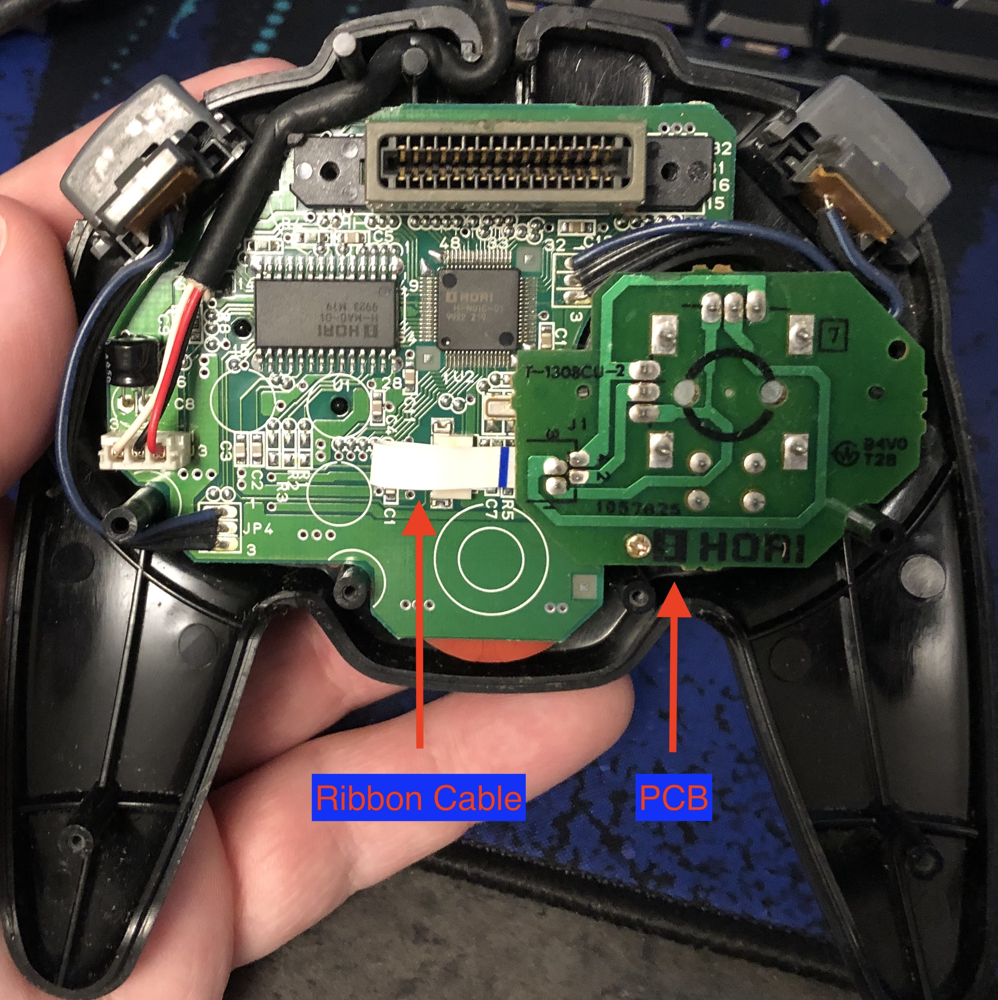

## Purpose

The purpose of this project is to design a form-fit-function replacement for the analog joystick assembly in the Horipad Mini 64 controller for the Nintendo 64.

{:toc}

## Background

A few months ago, my Horipad Mini 64 (Horipad) fell off of my desk, and the fall damaged the joystick beyond repair. Given that a used replacement Horipad can cost anywhere from about $60 up to $100 USD, I decided I'd try my hand at addressing the real issue: nobody sells replacement parts for the Horipad.

## Definitions

## Design Goals

1. Design a replacement printed circuit board (PCB) that can be installed into any Horipad without physical modifications to the controller.
2. Identify and procure an analog stick that can be installed onto the PCB (1) and is physically compatible with the Horipad analog joystick cap.
3. The analog stick pcb assembly (1)(2) should produce a stick pattern that is as close to the "Perfect Hori Pattern" as possible.

## Design
### Recreating the Board Outline
Arguably one of the more tedious tasks, recreating the board outline to be exactly the same shape and dimensions as the OEM daughter-board was the first design step in this project. This also included positioning and dimensioning the cutous for alignment pins and other pieces of the Horipad's top and bottom shell. There may have been a better way to achieve this, but I spent hours taking measurements with a caliper, creating CAD models, printing to scale, and even 3D printing the board outline until I finally had something that seemed close enough to work.

### Analog Stick Selection
Once I had a boardoutline to work with, I began research to find candidate replacement analog stick assemblies that would have the same or similar footprint as the OEM part. The other criteria was that the shaft of the analog stick needed to fit the donor Horipad joystick cap. Initially, I identified a single part to use, ordered some samples, and created a footprint to use for the PCB layout. One thing to note is that this particular analog stick part _did_ come assembled with potentiometers (not all of them come with the potentiometers).

### Potentiometers
Now comes the "fun" part. Potentiometers turned out to be the most critical part of the entire design.

### Resistor Mod

## Fab & Assembly

## Test
